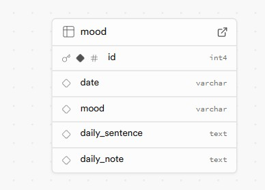

Project name: Daily Mode Tracker

Render link: 

Repo link: https://github.com/eminehorozoglu/week7-assignment

Project description:

This program is that you can follow your daily mode. You can enter your daily data in the DAIRY FORM tab. You can access the data you have entered in the DAIRY ENTRIES tab. You can delete your data entered in the DELETE DIARY ENTRIES tab by entering the id number.

Wireframe :

My Project Plan :

My Project Database :

Reflections:

 1- I had no problems writing and reading data to the SQL table. The only problem I had was that when I pulled the data from the SQL table, the date format was different and I could not convert it in Java. So I changed the column value of the table to varchar instead of date.

 2- I tried the delete page using the param value but I couldn't get the code to work. Instead, I asked the user for the value to be deleted and performed the delete operation using that value.

 3- Since we could not determine the home page at the first launch, the pages were appearing one inside the other. As a result of my research on the internet, I found the Route index element code and used it for the home page.
